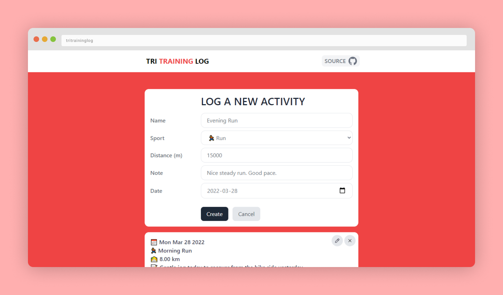

# TriTrainingLog

A simple SvelteKit CRUD web app that interacts with a NestJS backend.

## Table of contents <!-- omit in toc -->

- [☀ Introduction](#-introduction)
- [💭 What I learned](#-what-i-learned)
- [💿 Setup](#-setup)
  - [Prerequisites](#prerequisites)
  - [Get started](#get-started)
    - [Run in production](#run-in-production)
    - [Run in development](#run-in-development)
- [🛠 Technologies Used](#-technologies-used)

## ☀ Introduction

When working on the little [BoredApesTransfers](https://github.com/vcheeney/BoredApesTransfers) project I created last Friday, I got very excited about Svelte. So much that I quite literally spent my whole Sunday afternoon watching talks from [Rich Harris](https://twitter.com/Rich_Harris?ref_src=twsrc%5Egoogle%7Ctwcamp%5Eserp%7Ctwgr%5Eauthor) (creator of Svelte) explaining to audiences how JavaScript frameworks like React are not so "reactive". My favourite ones were:

- [Rich Harris: Futuristic Web Development](https://www.youtube.com/watch?v=qSfdtmcZ4d0&t=1111s)
- [The Return of 'Write Less, Do More' by Rich Harris | JSCAMP 2019](https://www.youtube.com/watch?v=BzX4aTRPzno)
- [Have Single-Page Apps Ruined the Web? | Transitional Apps with Rich Harris, NYTimes](https://www.youtube.com/watch?v=860d8usGC0o)

I could list much more but that's pretty much what happens when you dive deep into such a rabbit hole! 😅

Therefore, to get some more practice (and to try the NestJS node framework), I decided to build this simple "Todo" style CRUD web app.

## 💭 What I learned

- I learned about the `__layout.svelte` file which makes it easy to create a consistent layout across pages.
- I discovered the `<slot/>` tag which is pretty much the equivalent of `{children}` in React.
- As I tried to color the GitHub SVG icon in the navbar, I discovered that I could use the text color as long as I set the svg `fill="currentColor"` prop.
- Learned the general structure of a NestJS project
- Learned about the ValidationPipe in NestJS and how to automatically enforce DTO format with the `class-validator` decorators
- Did not get to use them much but learned how to emit and listen to events

## 💿 Setup

### Prerequisites

- Docker (recommended)
- Node v16 or above
- NPM

### Get started

First, clone the repository with the following command:

```sh
git clone git@github.com:vcheeney/TriTrainingLog.git
```

#### Run in production

To run everything in one go:

```sh
cp .env.example .env
docker-compose -f docker-compose.yml -f dc.backend.yml -f dc.frontend.yml up
```

#### Run in development

If you prefer to run the complete development setup, do the following.

In one terminal, start the database:

```sh
cp .env.example .env
docker-compose -f docker-compose.yml up
```

In another terminal, run the backend:

```sh
cd backend
cp .env.example .env
npx prisma migrate dev
npm run start:dev
```

In another terminal, run the frontend:

```sh
cd frontend
cp .env.example .env
npm run dev
```

## 🛠 Technologies Used

- [TypeScript 4.6.2](https://www.typescriptlang.org/docs/) - JavaScript superset
- [Svelte](https://kit.svelte.dev/) - Frontend compiler
- [SvelteKit](https://kit.svelte.dev/) - Web app framework
- [TailwindCSS 3.0.23](https://tailwindcss.com/docs/installation) - Utility-based CSS framework
- [NestJS 8.1.1](https://nestjs.com/) - Progressive Node.js framework

#### 🔗 Check out my other [**projects**](https://github.com/vcheeney) on my GitHub profile <!-- omit in toc -->
